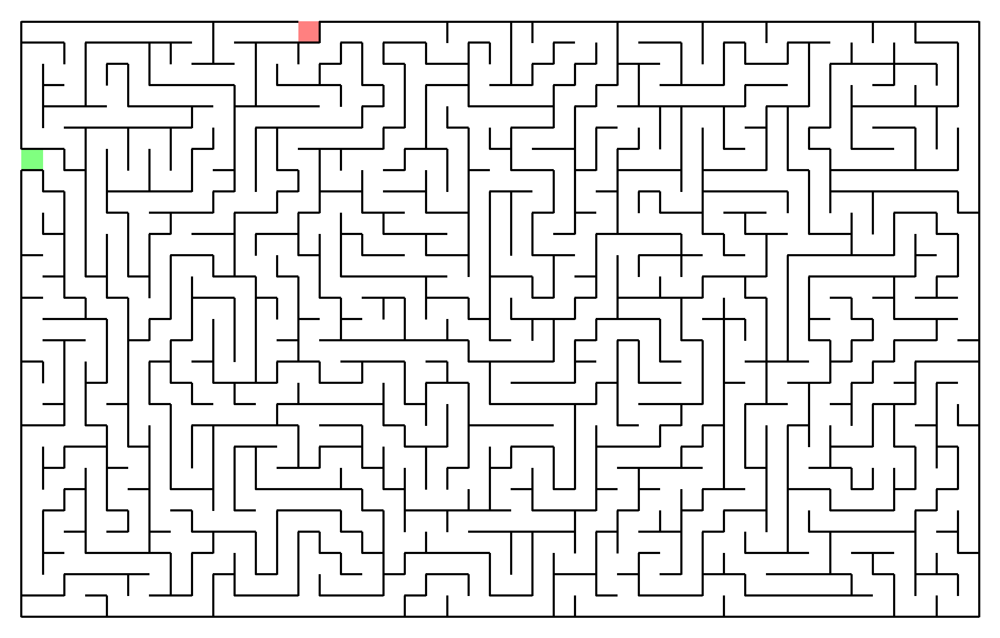
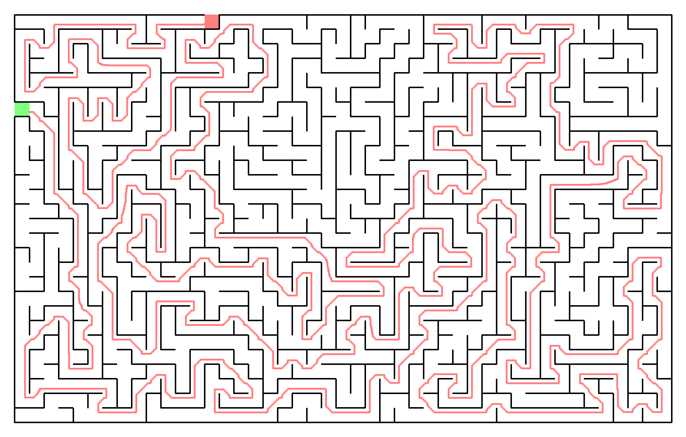

# maze-solver

This is a simple maze solver that uses the A* algorithm on mazes in a png format.

## Example

Given 

it will produce the following picture

## Usage

Build and run the program with

    stack run -- big-maze.png big-maze-solved.png